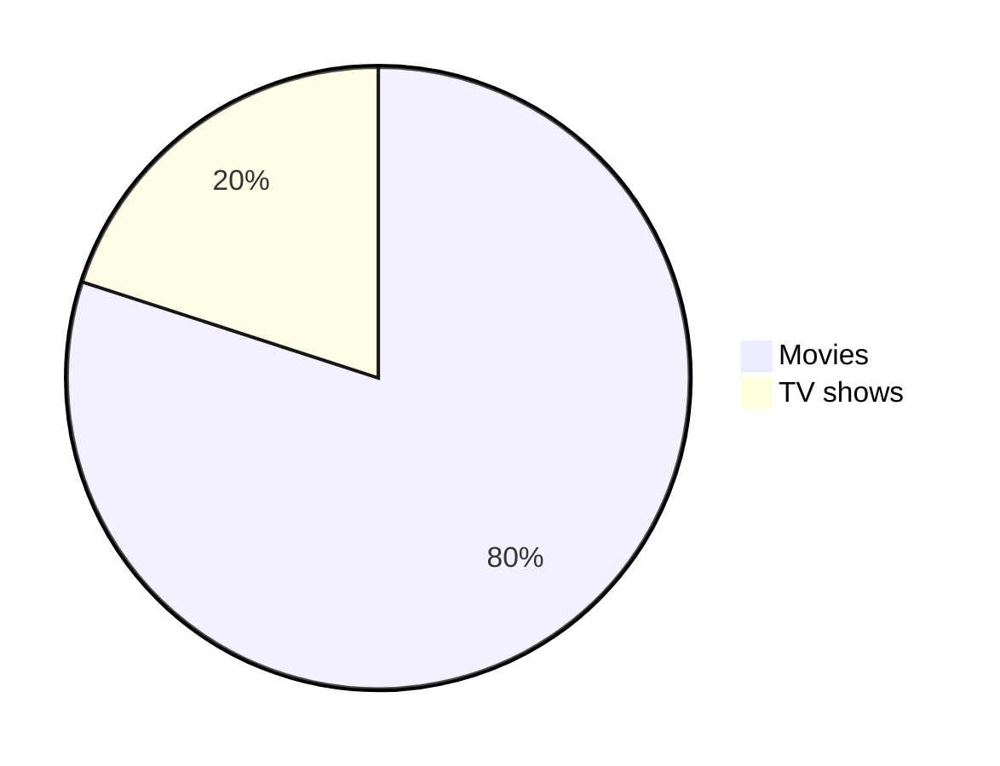

> Check out the official documentation on [GitHub](https://docs.github.com/en/get-started/writing-on-github/getting-started-with-writing-and-formatting-on-github/basic-writing-and-formatting-syntax) to learn more about writing and formatting syntax. Additionally, you can read the latest updates in the [changelogs](https://github.blog/changelog/label/markdown/).
{: .prompt-tip}

## Introduction

Markdown is a plain text formatting syntax designed for creating rich-text content with ease. It serves as both a method for writing formatted text and a tool for converting plain text into HTML.

- **2004:** [John Gruber](https://daringfireball.net/projects/markdown/) developed Markdown.
- **2014:** [CommonMark](https://commonmark.org/) was established as a standard specification for Markdown to resolve inconsistencies and ambiguities in Markdown implementations. This initiative was spearheaded by [John MacFarlane](https://github.com/jgm) and backed by other Markdown enthusiasts to ensure a reliable and consistent specification.

## Headings

<!-- markdownlint-capture -->
<!-- markdownlint-disable -->
# Heading 1
{: data-toc-skip=''}

## Heading 2
{: data-toc-skip=''}

### Heading 3
{: data-toc-skip=''}

#### Heading 4
{: data-toc-skip=''}

##### Heading 5
{: data-toc-skip=''}

###### Heading 6
{: data-toc-skip=''}
<!-- markdownlint-restore -->

```md
# Heading 1

## Heading 2

### Heading 3

#### Heading 4

##### Heading 5

###### Heading 6
```

## Text styles

### Normal

The quick brown fox jumps over the lazy dog.

```md
The quick brown fox jumps over the lazy dog.
```

### Bold

**The quick brown fox jumps over the lazy dog.**

__The quick brown fox jumps over the lazy dog.__

```md
**The quick brown fox jumps over the lazy dog.**

__The quick brown fox jumps over the lazy dog.__
```

### Italic

*The quick brown fox jumps over the lazy dog.*

_The quick brown fox jumps over the lazy dog._

```md
*The quick brown fox jumps over the lazy dog.*

_The quick brown fox jumps over the lazy dog._
```

### Bold and Italic

**_The quick brown fox jumps over the lazy dog._**

```md
**_The quick brown fox jumps over the lazy dog._**
```

### Blockquotes

> The quick brown fox jumps over the lazy dog.

<br>

> The quick brown fox jumps over the lazy dog.
>
> The quick brown fox jumps over the lazy dog.
>
> The quick brown fox jumps over the lazy dog.

<br>

> The quick brown fox jumps over the lazy dog.
>> The quick brown fox jumps over the lazy dog.
>>> The quick brown fox jumps over the lazy dog.

<br>

> **The quick brown fox** *jumps over the lazy dog.*

```md
> The quick brown fox jumps over the lazy dog.

<br>

> The quick brown fox jumps over the lazy dog.
>
> The quick brown fox jumps over the lazy dog.
>
> The quick brown fox jumps over the lazy dog.

<br>

> The quick brown fox jumps over the lazy dog.
>> The quick brown fox jumps over the lazy dog.
>>> The quick brown fox jumps over the lazy dog.

<br>

> **The quick brown fox** *jumps over the lazy dog.*
```

### Monospaced

<samp>The quick brown fox jumps over the lazy dog.</samp>

```md
<samp>The quick brown fox jumps over the lazy dog.</samp>
```

### Underlined

<ins>The quick brown fox jumps over the lazy dog.</ins>

```md
<ins>The quick brown fox jumps over the lazy dog.</ins>
```

### Strike-through

~~The quick brown fox jumps over the lazy dog.~~

```md
~~The quick brown fox jumps over the lazy dog.~~
```

<br>

<pre>
Lorem ipsum dolor sit amet, consectetur adipiscing elit. <strike>Sed do eiusmod tempor incididunt ut labore et dolore magna
aliqua.</strike> Ut enim ad minim veniam, quis nostrud exercitation ullamco laboris nisi ut aliquip ex ea commodo consequat.
Duis aute irure dolor in reprehenderit in voluptate velit esse cillum dolore eu fugiat nulla pariatur. <strike>Excepteur sint
occaecat cupidatat non proident, sunt in culpa qui officia deserunt mollit anim id est laborum.</strike>
</pre>

```md
<pre>
Lorem ipsum dolor sit amet, consectetur adipiscing elit. <strike>Sed do eiusmod tempor incididunt ut labore et dolore magna
aliqua.</strike> Ut enim ad minim veniam, quis nostrud exercitation ullamco laboris nisi ut aliquip ex ea commodo consequat.
Duis aute irure dolor in reprehenderit in voluptate velit esse cillum dolore eu fugiat nulla pariatur. <strike>Excepteur sint
occaecat cupidatat non proident, sunt in culpa qui officia deserunt mollit anim id est laborum.</strike>
</pre>
```

### Subscript

log<sub>2</sub>(x)

Subscript <sub>The quick brown fox jumps over the lazy dog.</sub>

```md
log<sub>2</sub>(x)

Subscript <sub>The quick brown fox jumps over the lazy dog.</sub>
```

### Superscript

2 <sup>53-1</sup> and -2 <sup>53-1</sup>

Superscript <sup>The quick brown fox jumps over the lazy dog.</sup>

```md
2 <sup>53-1</sup> and -2 <sup>53-1</sup>

Superscript <sup>The quick brown fox jumps over the lazy dog.</sup>
```

### Text Color

[MathJax](#Mathematics) syntax: [mathjax color](https://github.com/lifeparticle/Markdown-Cheatsheet/blob/main/MathJax.md)

### Multiline

The quick\
brown fox\
jumps over\
the lazy dog.

```md
The quick\
brown fox\
jumps over\
the lazy dog.
```

## Tables

| Default | Left align | Center align | Right align |
| - | :- | :-: | -: |
| 9999999999 | 9999999999 | 9999999999 | 9999999999 |
| 999999999 | 999999999 | 999999999 | 999999999 |
| 99999999 | 99999999 | 99999999 | 99999999 |
| 9999999 | 9999999 | 9999999 | 9999999 |

| Default    | Left align | Center align | Right align |
| ---------- | :--------- | :----------: | ----------: |
| 9999999999 | 9999999999 | 9999999999   | 9999999999  |
| 999999999  | 999999999  | 999999999    | 999999999   |
| 99999999   | 99999999   | 99999999     | 99999999    |
| 9999999    | 9999999    | 9999999      | 9999999     |

```md
| Default | Left align | Center align | Right align |
| - | :- | :-: | -: |
| 9999999999 | 9999999999 | 9999999999 | 9999999999 |
| 999999999 | 999999999 | 999999999 | 999999999 |
| 99999999 | 99999999 | 99999999 | 99999999 |
| 9999999 | 9999999 | 9999999 | 9999999 |

| Default    | Left align | Center align | Right align |
| ---------- | :--------- | :----------: | ----------: |
| 9999999999 | 9999999999 | 9999999999   | 9999999999  |
| 999999999  | 999999999  | 999999999    | 999999999   |
| 99999999   | 99999999   | 99999999     | 99999999    |
| 9999999    | 9999999    | 9999999      | 9999999     |
```

## Links

### Inline

[Markdown cheat sheet](https://carvychen.github.io/posts/markdown_cheat_sheet/)

```md
[Markdown cheat sheet](https://carvychen.github.io/posts/markdown_cheat_sheet/)
```

### Reference

[Markdown cheat sheet][Reference text]

[Markdown cheat sheet][1]

[Reference text]

[Reference text]: https://carvychen.github.io/posts/markdown_cheat_sheet/
[1]: https://carvychen.github.io/posts/markdown_cheat_sheet/

```md
[Markdown cheat sheet][Reference text]

[Markdown cheat sheet][1]

[Reference text]

[Reference text]: https://carvychen.github.io/posts/markdown_cheat_sheet/
[1]: https://carvychen.github.io/posts/markdown_cheat_sheet/
```

### Footnote

Footnote.[^1]

Some other important footnote.[^2]

[^1]: This is footnote number one.
[^2]: Here is the second footnote.

```md
Footnote.[^1]

Some other important footnote.[^2]

[^1]: This is footnote number one.
[^2]: Here is the second footnote.
```

### Relative

[Example of a relative link](relative.md)

```md
[Example of a relative link](relative.md)
```

### Hover

You can use [BinaryTree](https://binarytree.dev/ "Array of Developer Productivity Tools Designed to Help You Save Time") to create markdown tables.

```md
You can use [BinaryTree](https://binarytree.dev/ "Array of Developer Productivity Tools Designed to Help You Save Time") to create markdown tables.
```

### Enclosed

<https://github.com/>

```md
<https://github.com/>
```

## Images

> alt text: optional \
> Title text: optional


```md

```

<br>

![alt text][image]

[image]: https://cdn.jsdelivr.net/gh/carvychen/asset-data/images/avatar.png "Title text"

```md
![alt text][image]

[image]: https://cdn.jsdelivr.net/gh/carvychen/asset-data/images/avatar.png "Title text"
```

<br>


```md

```

## Badges


 

 

 


```md


 

 

 


```

## Lists

### Ordered

1. One
2. Two
3. Three

```md
1. One
2. Two
3. Three
```

### Unordered

- First level
  - Second level
    - Third level
      - Fourth level
- First level
  - Second level
- First level
  - Second level

```md
- First level
  - Second level
    - Third level
      - Fourth level
- First level
  - Second level
- First level
  - Second level
```

### Task

- [x] Fix Bug 223
- [ ] Add Feature 33
- [ ] Add unit tests

```md
- [x] Fix Bug 223
- [ ] Add Feature 33
- [ ] Add unit tests
```

## Buttons

<kbd>cmd + shift + p</kbd>

```md
<kbd>cmd + shift + p</kbd>
```

[<kbd>markdown cheat sheet</kbd>](https://carvychen.github.io/posts/markdown_cheat_sheet/)

```md
[<kbd>markdown cheat sheet</kbd>](https://carvychen.github.io/posts/markdown_cheat_sheet/)
```

## Collapsible items

<details>
  <summary>Markdown</summary>

- <kbd>[Markdown Editor](https://binarytree.dev/me)</kbd>
- <kbd>[Table Of Content](https://binarytree.dev/toc)</kbd>
- <kbd>[Markdown Table Generator](https://binarytree.dev/md_table_generator)</kbd>

</details>

```md
<details>
  <summary>Markdown</summary>

- <kbd>[Markdown Editor](https://binarytree.dev/me)</kbd>
- <kbd>[Table Of Content](https://binarytree.dev/toc)</kbd>
- <kbd>[Markdown Table Generator](https://binarytree.dev/md_table_generator)</kbd>

</details>
```

## Horizontal Rule

---

***
___

```md
---
***
___
```

## Diagrams



````md

````

## Mathematics

> Check out the official documentation on [GitHub](https://docs.github.com/en/get-started/writing-on-github/working-with-advanced-formatting/writing-mathematical-expressions) to learn more about writing and formatting MathJax syntax.
{: .prompt-tip}

This is an inline math expression $x = {-b \pm \sqrt{b^2-4ac} \over 2a}$

```md
This is an inline math expression $x = {-b \pm \sqrt{b^2-4ac} \over 2a}$
```

<br>

$$
x = {-b \pm \sqrt{b^2-4ac} \over 2a}
$$

```md
$$
x = {-b \pm \sqrt{b^2-4ac} \over 2a}
$$
```

## Miscellaneous

### Comments

<!--
Lorem ipsum dolor sit amet
-->

```md
<!--
Lorem ipsum dolor sit amet
-->
```

### Emojis

[Complete list of github emoji](https://gist.github.com/rxaviers/7360908)

### Line break

<!-- markdownlint-disable-next-line MD038 -->
You can use `<br>` to insert a single line break.

Lorem ipsum dolor sit amet, consectetur adipiscing elit. <br> Sed do eiusmod tempor incididunt ut labore et dolore magna.

```md
Lorem ipsum dolor sit amet, consectetur adipiscing elit. <br> Sed do eiusmod tempor incididunt ut labore et dolore magna.
```